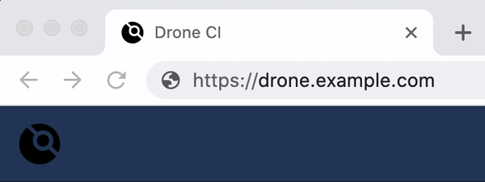

# drone-ui-alerts
This script adds updating favicon and desktop notifications to [drone.io ui](https://github.com/drone/drone-ui).

## What does this do

It makes the drone-ui favicon refelect the status of the pipeline on the current page instead of the status of all pipelines running.

It also sends a notification when the pipeline status changes.

## Why

It is annoying to keep checking the drone page for updates instead of looking at the favicon or seeing a notification. There is an [open issue](https://github.com/drone/drone-ui/issues/290) in the drone-ui repo about this.

## Installation

This script was designed to be used with [Violentmonkey](https://violentmonkey.github.io/) but should also work with [Greasemonkey](https://wiki.greasespot.net/Greasemonkey) or [Tampermonkey](https://www.tampermonkey.net/).

To use this script just install one of the extension above, click [create new script](https://violentmonkey.github.io/guide/creating-a-userscript/), and paste [this](https://github.com/RayBB/drone-ui-alerts/blob/main/index.js) script.

You should update the `@match` section at the top of the script with the url of your drone installation.

### Bookmarklets

You can make a [bookmarklet](https://en.wikipedia.org/wiki/Bookmarklet) to run as needed instead of installing an extension. I recommend creating the bookmarklet using [this](https://chriszarate.github.io/bookmarkleter/) tool. Notifications won't work with the bookmarklet since they depend on the [GM_notification](https://violentmonkey.github.io/api/gm/#gm_notification) api.

## Next Steps

* Use [getValue](https://violentmonkey.github.io/api/gm/#gm_getvalue) for user preferences s
* Use a more object oriented approach
* Evaluate using the [MutationObserver](https://developer.mozilla.org/en-US/docs/Web/API/MutationObserver) instead of polling

## Learnings

* You cannot use CSS to change SVGs when they are encoded in `img` tags. Otherwise I would use CSS to [change the SVG color](https://css-tricks.com/lodge/svg/09-svg-data-uris/).
* You [don't](https://css-tricks.com/probably-dont-base64-svg/) need to base64 encode [data URI](https://en.wikipedia.org/wiki/Data_URI_scheme), but you may need to encode them with [encodeURIComponent](https://developer.mozilla.org/en-US/docs/Web/JavaScript/Reference/Global_Objects/encodeURIComponent).
